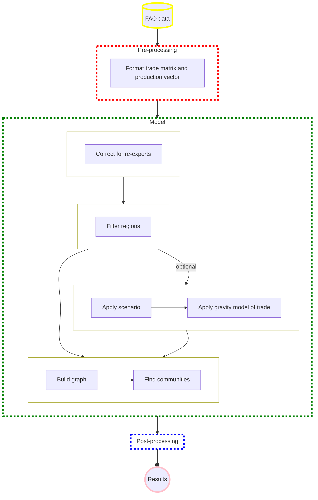

# PyTradeShifts

 

## What this is and what it can be used for

PyTradeShifts is using a network model to simulate how trade communities might shift due to changes in yield. This is based on the model presented in [Hedlung et al. (2022)](https://iopscience.iop.org/article/10.1088/1748-9326/aca68b). To make it possible to directly use yield reductions to change the trade flows, we have to account for re-exports. This is done using the re-export algorithm from [Croft et al. (2018)](https://www.sciencedirect.com/science/article/pii/S0959652618326180), as implemented in Hedlung et al. (2022), which allows countries only to export as much as they actually produce. 

This allows us to change the trade flows, by changing the yields. Therefore, you can take any yield modelling results you have for different crops, feed them into this model and see how the trade flows change due to the changed yields. All this can be done via a single interface, which is explained below and in the [Jupyter notebooks of this repository](https://github.com/allfed/pytradeshifts/tree/main/scripts). 

## Installation
To install the pytradeshifts Model package, we recommend setting up a virtual environment. This will ensure that the package and its dependencies are isolated from other projects on your machine, which can prevent conflicts and make it easier to manage your dependencies. Here are the steps to follow:

* Create a virtual environment using conda by running the command `conda env create -f environment.yml`. This will create an environment called "pytradeshifts". A virtual environment is like a separate Python environment, which you can think of as a separate "room" for your project to live in, it's own space which is isolated from the rest of the system, and it will have it's own set of packages and dependencies, that way you can work on different projects with different versions of packages without interfering with each other.

* Activate the environment by running `conda activate pytradeshifts`. This command will make the virtual environment you just created the active one, so that when you run any python command or install any package, it will do it within the environment.

* Install the package by running `pip install -e .` in the main folder of the repository. This command will install the package you are currently in as a editable package, so that when you make changes to the package, you don't have to reinstall it again.

* If you want to run the example Jupyter notebook, you'll need to create a kernel for the environment. First, install the necessary tools by running `conda install -c anaconda ipykernel`. This command will install the necessary tools to create a kernel for the Jupyter notebook. A kernel is a component of Jupyter notebook that allows you to run your code. It communicates with the notebook web application and the notebook document format to execute code and display the results.

* Then, create the kernel by running `python -m ipykernel install --user --name=pytradeshifts`. This command will create a kernel with the name you specified "pytradeshifts" , which you can use to run the example notebook or play around with the model yourself.

You can now use the kernel "pytradeshifts" to run the example notebook or play around with the model yourself. If you are using the kernel and it fails due an import error for the model package, you might have to rerun: `pip install -e .`

## How to use this

The interface of the model is the class [PyTradeShifts in `model.py`](https://github.com/allfed/pytradeshifts/blob/main/src/model.py#L21). To work with the model you just have to create an instance of this class and specify all the keywords like you see fit (just click the link above to see all the keywords available):

`Wheat2018 = PyTradeShifts("Wheat", 2018)`

As you can see there are only two parameters that don't have default values. The crop you want to look at ("Wheat" in this case) and the base year you want to use (2018 in this case). This means every instance you create ia for a specific crop. The crops that are available is everything that is tracked in the [FAO database](http://www.fao.org/faostat/en/#data/TM) (though you likely want to stick with the bigger crops, to have more reliable results). The base year can be any year from 1961 (when the FAO started tracking) until today (if you have downloaded the most recent data). As trade partners tend to be sticky, changing this by a few years does not make a big difference in most cases. However, in general you want to use the most recent base year to better represent the present world. 

### Running the model with a yield reduction scenario
One of the main tasks of this model is to try to understand how trade communities might change if yield is reduced, due to catastrophic events like extreme climate change or a large volcanic eruption. To do so you have to provide the model with a file the specificies how much the yield is reduced (in % reduction). These have to be put in the [scenario files folder](https://github.com/allfed/pytradeshifts/tree/main/data/scenario_files).  [An example](https://github.com/allfed/pytradeshifts/blob/main/data/scenario_files/ISIMIP_climate/ISIMIP_wheat_Hedlung.csv), of a scenario file is the reduction of wheat yields from the ISIMIP project. How to use a scenario is shown in [this Jupyter notebook](https://github.com/allfed/pytradeshifts/blob/main/scripts/ISIMIP_example.ipynb). 

### Running the model with a long distance trade penality
In addition to the option to run the model with a yield reduction scenario, you can also apply an additional factor [`beta`](https://github.com/allfed/pytradeshifts/blob/main/src/model.py#L51) to specify how much long distance trade should be penalized. This is meant to symbolize the increased difficulties of trade after a catastrophe and follows a gravity model of trade approach.

## Getting the data

The repository already comes with pretty recent version of the FAO data, but if it is important to have the most recent one, you can download the data from the FAO: 1) [trade](http://www.fao.org/faostat/en/#data/TM) 2) [production](http://www.fao.org/faostat/en/#data/QC)

## Having problems?

If you encounter any issues, feel free to open an issue in the repository or contact florian@allfed.info

## Flowchart

