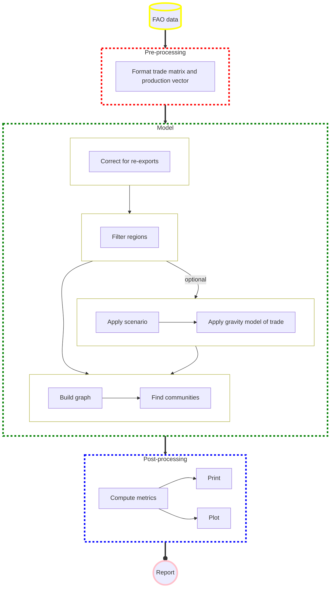

```mermaid
%%{ init: { 'flowchart': { 'curve': 'natural' } } }%%
flowchart TD
    subgraph id_pre [Pre-processing]
    direction LR
    id_pre_3[Format trade matrix and production vector]
    end
    subgraph id_mod [Model]
    direction TB
        subgraph id_mod_sub_1 [" "]
        direction LR
        id_mod_4[Correct for re-exports]
        end
        id_mod_sub_1 --> id_mod_sub_2
        subgraph id_mod_sub_2 [" "]
        direction LR
        id_mod_6[Filter regions]
        end
        id_mod_sub_2 -->|optional| id_mod_sub_3
        id_mod_sub_2 --> id_mod_sub_4
        subgraph id_mod_sub_3 [" "]
        id_mod_8[Apply scenario]
        id_mod_9[Apply gravity model of trade]
        id_mod_8 --> id_mod_9
        end
        id_mod_sub_3 --> id_mod_sub_4
        subgraph id_mod_sub_4 [" "]
        id_mod_10[Build graph] --> id_mod_11[Find communities]
        end
    end
    subgraph id_pos [Post-processing]
    direction LR
    id_pos_1[Compute metrics] --> id_pos_2[Print]
    id_pos_1 --> id_pos_3[Plot]
    end
    FAO[(FAO data)] ==> id_pre
    id_pre ==> id_mod
    id_mod ==> id_pos
    id_pos ==o RES((Report))

    style id_pre fill:None,stroke:red,stroke-width:4px,stroke-dasharray: 5 5
    style id_mod fill:None,stroke:green,stroke-width:4px,stroke-dasharray: 5 5
    style id_pos fill:None,stroke:blue,stroke-width:4px,stroke-dasharray: 5 5
    style id_mod_sub_1 fill:None
    style id_mod_sub_2 fill:None
    style id_mod_sub_3 fill:None
    style id_mod_sub_4 fill:None
    style RES stroke:pink,stroke-width:4px
    style FAO stroke:yellow,stroke-width:4px
```