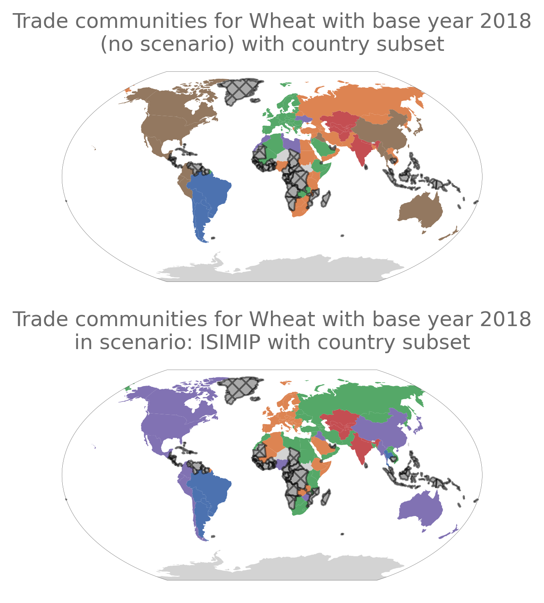
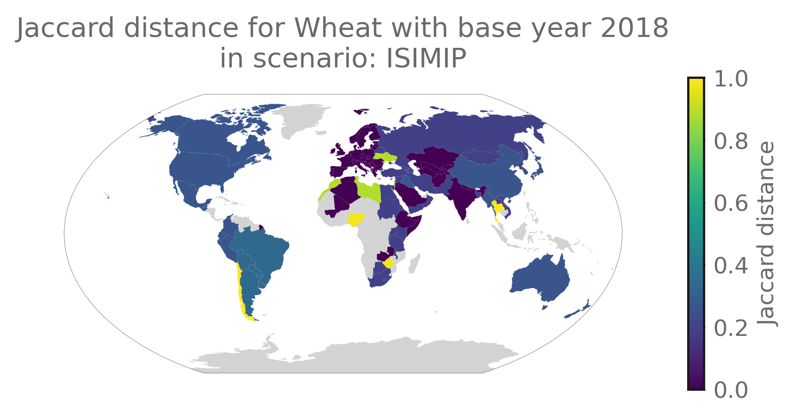
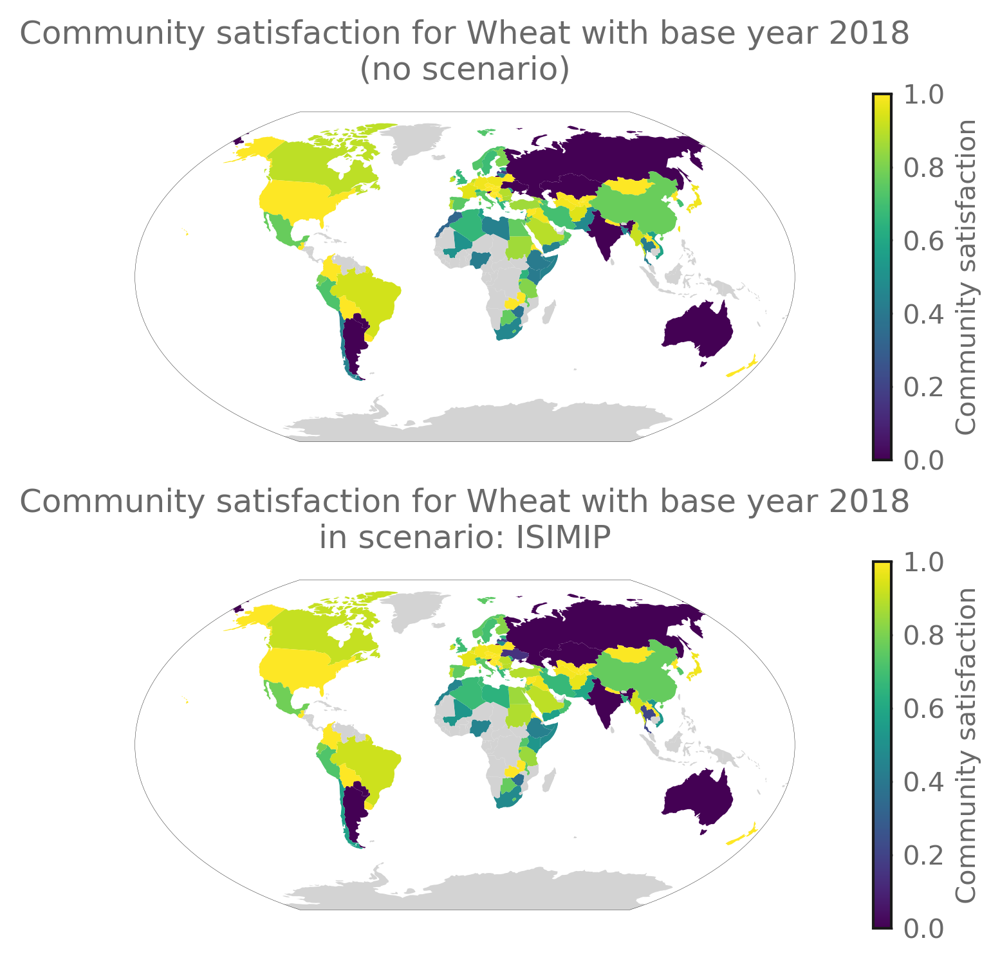
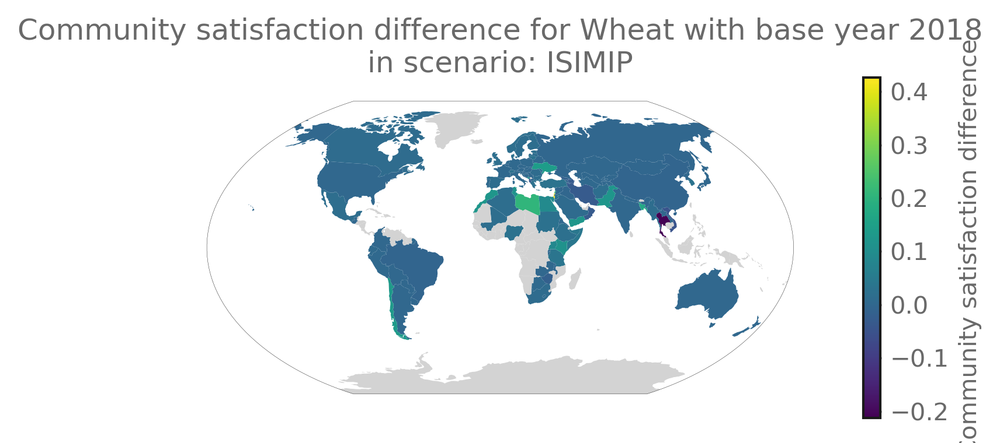
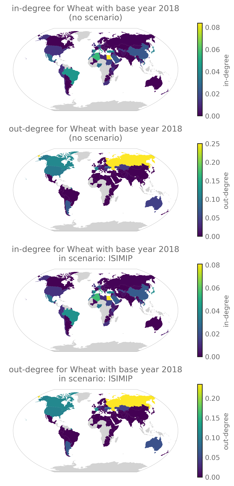
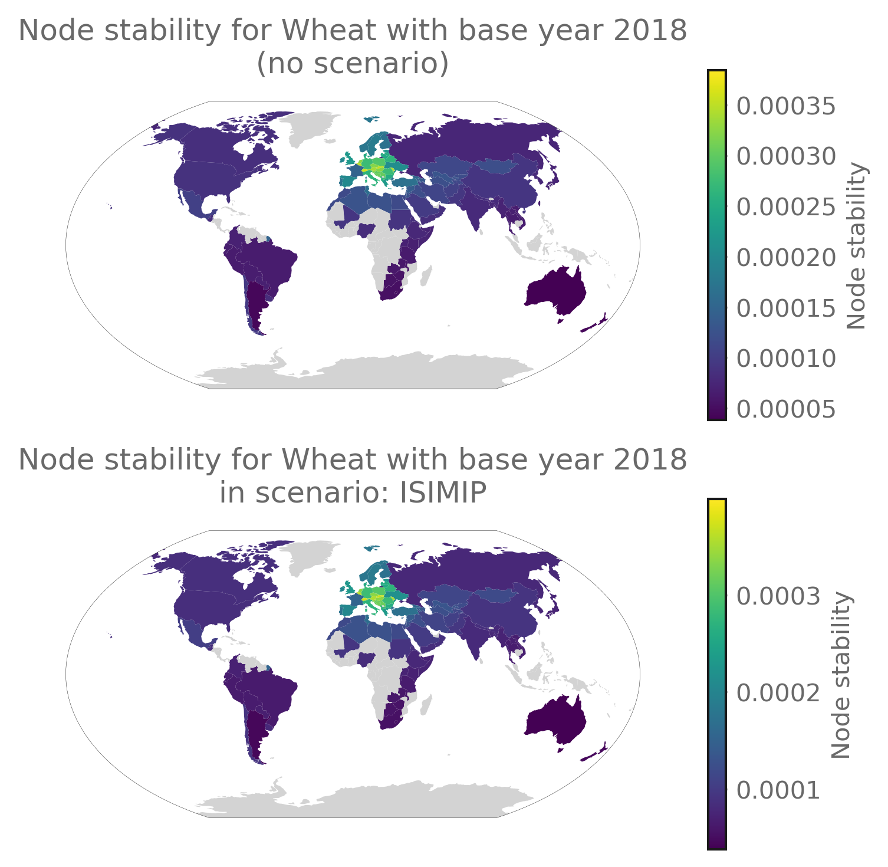
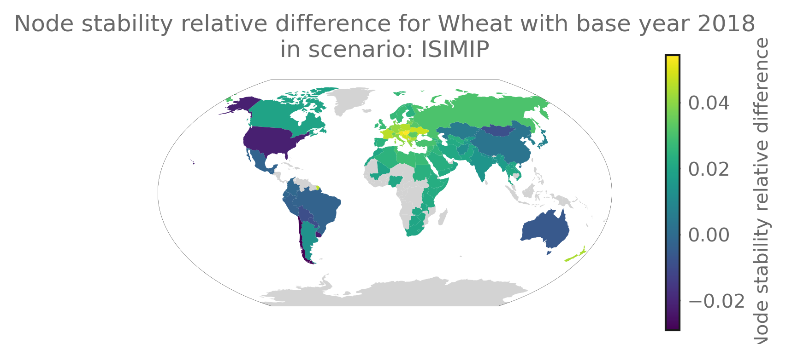
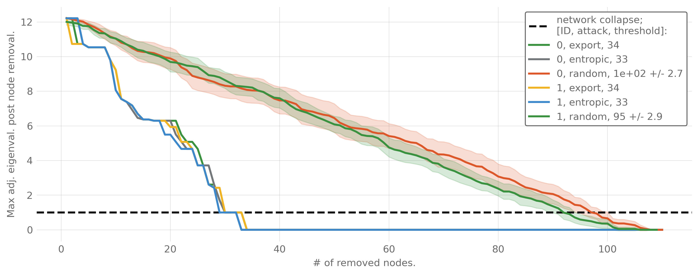

# PyTradeShifts Report 2024-03-04 15:52:28 UTC

  

## Trade communities

## Difference in trade communities

## Community satisfaction

## Difference in community satisfaction

## Graph structural difference to base scenario (ID=0)

<table class="dataframe" data-border="1">
<thead>
<tr class="header" style="text-align: center;">
<th></th>
<th>Frobenius</th>
<th>Markov</th>
<th>Entropy rate</th>
</tr>
<tr class="odd">
<th>Scenario ID</th>
<th></th>
<th></th>
<th></th>
</tr>
</thead>
<tbody>
<tr class="odd">
<th>1</th>
<td>3.085576e+06</td>
<td>5.893734e-16</td>
<td>-0.000004</td>
</tr>
</tbody>
</table>

## Centrality metrics by scenario

<table class="dataframe" data-border="1">
<thead>
<tr class="header" style="text-align: center;">
<th></th>
<th>Smallest in-degree country</th>
<th>Smallest in-degree value</th>
<th>Largest in-degree country</th>
<th>Largest in-degree value</th>
<th>Smallest out-degree country</th>
<th>Smallest out-degree value</th>
<th>Largest out-degree country</th>
<th>Largest out-degree value</th>
</tr>
<tr class="odd">
<th>Scenario ID</th>
<th></th>
<th></th>
<th></th>
<th></th>
<th></th>
<th></th>
<th></th>
<th></th>
</tr>
</thead>
<tbody>
<tr class="odd">
<th>0</th>
<td>Argentina</td>
<td>0.0</td>
<td>Egypt</td>
<td>0.083767</td>
<td>Afghanistan</td>
<td>0.0</td>
<td>Russia</td>
<td>0.250466</td>
</tr>
<tr class="even">
<th>1</th>
<td>Argentina</td>
<td>0.0</td>
<td>Egypt</td>
<td>0.080807</td>
<td>Afghanistan</td>
<td>0.0</td>
<td>Russia</td>
<td>0.235348</td>
</tr>
</tbody>
</table>

## Centrality metrics by community

### Degree centrality metrics for the scenario with ID: 0

  

<table class="dataframe" data-border="1">
<thead>
<tr class="header" style="text-align: center;">
<th></th>
<th>Smallest in-degree country</th>
<th>Smallest in-degree value</th>
<th>Largest in-degree country</th>
<th>Largest in-degree value</th>
<th>Smallest out-degree country</th>
<th>Smallest out-degree value</th>
<th>Largest out-degree country</th>
<th>Largest out-degree value</th>
</tr>
<tr class="odd">
<th>Community ID</th>
<th></th>
<th></th>
<th></th>
<th></th>
<th></th>
<th></th>
<th></th>
<th></th>
</tr>
</thead>
<tbody>
<tr class="odd">
<th>0</th>
<td>Argentina</td>
<td>0.000000</td>
<td>Brazil</td>
<td>0.044370</td>
<td>Bolivia</td>
<td>0.0</td>
<td>Argentina</td>
<td>0.069987</td>
</tr>
<tr class="even">
<th>1</th>
<td>Laos</td>
<td>0.000002</td>
<td>Egypt</td>
<td>0.083767</td>
<td>Albania</td>
<td>0.0</td>
<td>Russia</td>
<td>0.250466</td>
</tr>
<tr class="odd">
<th>2</th>
<td>Slovenia</td>
<td>0.000000</td>
<td>Algeria</td>
<td>0.056121</td>
<td>Algeria</td>
<td>0.0</td>
<td>France</td>
<td>0.113239</td>
</tr>
<tr class="even">
<th>3</th>
<td>India</td>
<td>0.000217</td>
<td>Uzbekistan</td>
<td>0.015324</td>
<td>Afghanistan</td>
<td>0.0</td>
<td>Kazakhstan</td>
<td>0.040950</td>
</tr>
<tr class="odd">
<th>4</th>
<td>Ukraine</td>
<td>0.000012</td>
<td>Morocco</td>
<td>0.027824</td>
<td>Israel</td>
<td>0.0</td>
<td>Ukraine</td>
<td>0.072740</td>
</tr>
<tr class="even">
<th>5</th>
<td>Australia</td>
<td>0.000000</td>
<td>Japan</td>
<td>0.037054</td>
<td>Colombia</td>
<td>0.0</td>
<td>Canada</td>
<td>0.117273</td>
</tr>
</tbody>
</table>

### Degree centrality metrics for the scenario with ID: 1

  

<table class="dataframe" data-border="1">
<thead>
<tr class="header" style="text-align: center;">
<th></th>
<th>Smallest in-degree country</th>
<th>Smallest in-degree value</th>
<th>Largest in-degree country</th>
<th>Largest in-degree value</th>
<th>Smallest out-degree country</th>
<th>Smallest out-degree value</th>
<th>Largest out-degree country</th>
<th>Largest out-degree value</th>
</tr>
<tr class="odd">
<th>Community ID</th>
<th></th>
<th></th>
<th></th>
<th></th>
<th></th>
<th></th>
<th></th>
<th></th>
</tr>
</thead>
<tbody>
<tr class="odd">
<th>0</th>
<td>Argentina</td>
<td>0.000000</td>
<td>Brazil</td>
<td>0.041255</td>
<td>Bolivia</td>
<td>0.0</td>
<td>Argentina</td>
<td>0.065466</td>
</tr>
<tr class="even">
<th>1</th>
<td>Slovenia</td>
<td>0.000000</td>
<td>Algeria</td>
<td>0.055753</td>
<td>Algeria</td>
<td>0.0</td>
<td>France</td>
<td>0.114812</td>
</tr>
<tr class="odd">
<th>2</th>
<td>Laos</td>
<td>0.000002</td>
<td>Egypt</td>
<td>0.080807</td>
<td>Albania</td>
<td>0.0</td>
<td>Russia</td>
<td>0.235348</td>
</tr>
<tr class="even">
<th>3</th>
<td>Kazakhstan</td>
<td>0.000236</td>
<td>Uzbekistan</td>
<td>0.016655</td>
<td>Afghanistan</td>
<td>0.0</td>
<td>Kazakhstan</td>
<td>0.044550</td>
</tr>
<tr class="odd">
<th>4</th>
<td>Australia</td>
<td>0.000000</td>
<td>Japan</td>
<td>0.039187</td>
<td>Chile</td>
<td>0.0</td>
<td>Canada</td>
<td>0.109454</td>
</tr>
</tbody>
</table>

## Centrality map

## Stability map

## Difference in stability

## General network characteristics

<table class="dataframe" data-border="1">
<thead>
<tr class="header" style="text-align: center;">
<th></th>
<th>Betweenness</th>
<th>Clustering</th>
<th>Efficiency</th>
<th>Entropic-attack threshold</th>
<th>Export-attack threshold</th>
<th>Random-attack threshold</th>
<th>Stability</th>
</tr>
<tr class="odd">
<th>Scenario ID</th>
<th></th>
<th></th>
<th></th>
<th></th>
<th></th>
<th></th>
<th></th>
</tr>
</thead>
<tbody>
<tr class="odd">
<th>0</th>
<td>0.008394</td>
<td>0.001634</td>
<td>0.222011</td>
<td>33</td>
<td>34</td>
<td>1e+02 +/- 1.4</td>
<td>0.000137</td>
</tr>
<tr class="even">
<th>1</th>
<td>0.008557</td>
<td>0.001744</td>
<td>0.218211</td>
<td>33</td>
<td>34</td>
<td>95 +/- 1.5</td>
<td>0.000142</td>
</tr>
</tbody>
</table>

## Attack resilience

